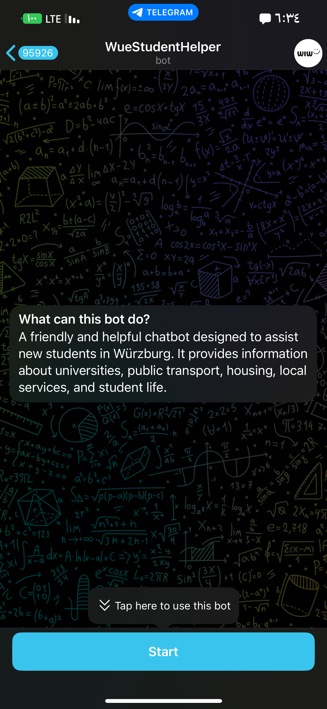
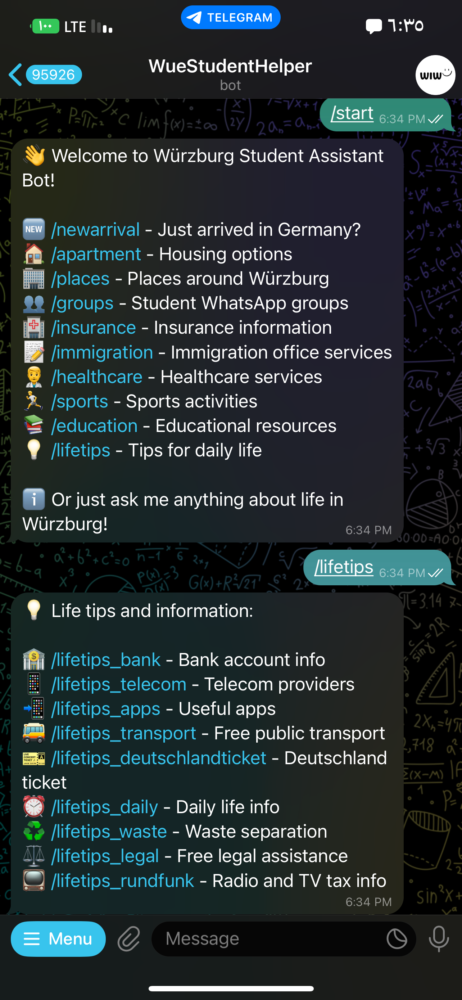

<div align="center">
  
  <h1>Würzburg Student Assistant</h1>
</div>

A comprehensive assistant system for new students in Würzburg, featuring both a FastAPI backend and a Telegram bot interface. The system uses Retrieval-Augmented Generation (RAG) and OpenAI models to provide intelligent responses and recommendations for essential daily life tasks.

<div align="center">
  <table>
    <tr>
      <td></td>
      <td></td>
    </tr>
  </table>
</div>

## Setup

1. Create a virtual environment:

```bash
python -m venv venv
source venv/bin/activate  # On Windows: venv\Scripts\activate
```

2. Install dependencies:

```bash
pip install -r requirements.txt
```

3. Set up PostgreSQL:

   - Install PostgreSQL from the official website
   - Remember your username and password

4. Configure environment variables:

   - Copy `.env.example` to `.env`
   - Update the `DATABASE_URL` with your PostgreSQL credentials
   - Add your OpenAI API key
   - Set your `TELEGRAM_BOT_TOKEN` (get it from `@BotFather` on Telegram)
   - Set `DEVELOPER_USER_ID` (your Telegram user ID, get it from `@userinfobot`)

5. Upload initial data to the database:

```bash
python scripts/upload_data.py
```

Note: Run this script whenever you modify the JSON files in the `data/json_data` directory. Make sure to maintain the existing data structure when updating the JSON files.

6. Run the application (choose one):

For the FastAPI server:

```bash
uvicorn app.main:app --reload
```

For the Telegram bot:

```bash
python run_bot.py
```

## API Documentation

Once the backend server is running, visit:

- Swagger UI: http://localhost:8000/docs
- ReDoc: http://localhost:8000/redoc
